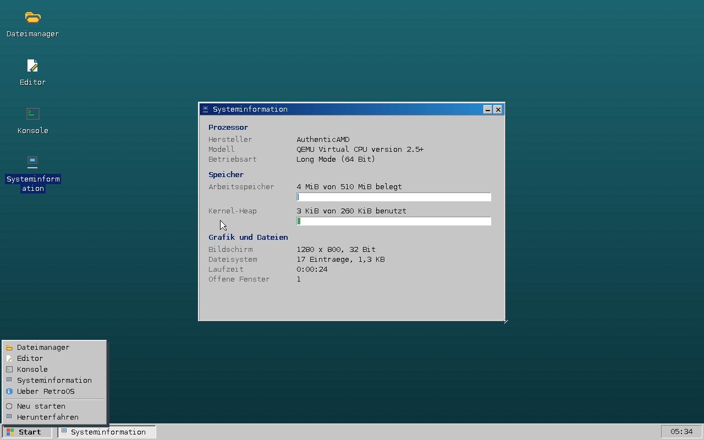

# RetroOS

Ein kleines, vollständig eigenes Betriebssystem für x86-64-Rechner – mit
eigenem 64-Bit-Kernel, eigenen Treibern, eigenem Fenstersystem und einem
grafischen Dateimanager.

Kein Linux-Unterbau, keine libc, kein fremdes GUI-Toolkit. Übernommen wurde
allein der Bootloader ([Limine](https://github.com/limine-bootloader/limine)),
der den Kernel im Long Mode startet und einen linearen Framebuffer bereitstellt.


```
┌──────────────────────────────────────────────────────────────┐
│  Desktop · Taskleiste · Startmenü                            │
│  Dateimanager · Editor · Konsole · Systeminformation         │
├──────────────────────────────────────────────────────────────┤
│  Fenstersystem  (Fenster, Menüs, Dialoge, Bedienelemente)    │
├──────────────────────────────────────────────────────────────┤
│  Grafik (Backbuffer, Schrift, Symbole)  ·  RAM-Dateisystem   │
├──────────────────────────────────────────────────────────────┤
│  Treiber: PS/2-Tastatur, PS/2-Maus, PIT, RTC, UART           │
├──────────────────────────────────────────────────────────────┤
│  Kern: GDT, IDT, PIC, Seitenverwaltung, Heap                 │
└──────────────────────────────────────────────────────────────┘
```

## Bauen und starten

Vorausgesetzt werden `gcc`, `binutils`, `make`, `xorriso` und `git`
(zum Nachladen des Bootloaders). Zum Ausprobieren zusätzlich `qemu-system-x86`.

```sh
sudo apt install build-essential xorriso qemu-system-x86 ovmf
make                # baut den Kernel und retroos.iso
make run            # startet das System in QEMU (BIOS)
make run-uefi       # startet das System in QEMU (UEFI, benötigt OVMF)
```

Das erzeugte `retroos.iso` ist ein Hybrid-Image: es bootet per BIOS *und*
per UEFI, aus einem virtuellen Laufwerk ebenso wie von einem USB-Stick.

```sh
sudo dd if=retroos.iso of=/dev/sdX bs=4M status=progress conv=fsync
```

> Auf echter Hardware werden eine PS/2-Tastatur und eine PS/2-Maus erwartet.
> Die meisten Notebooks emulieren das für ihre eingebauten Geräte; an reinen
> USB-Ports hilft die BIOS-Einstellung „USB Legacy Support".

## Bedienung

| Aktion | Wirkung |
| --- | --- |
| Doppelklick auf ein Desktop-Symbol | Programm starten |
| Start-Knopf unten links | Menü mit allen Programmen |
| Titelleiste ziehen | Fenster verschieben |
| Ecke unten rechts ziehen | Fenster vergrößern |
| `_` / `X` in der Titelleiste | Fenster ablegen / schließen |
| Klick in der Taskleiste | Fenster holen oder ablegen |



**Dateimanager:** Doppelklick öffnet Ordner und Dateien, die rechte Maustaste
öffnet das Kontextmenü. Über die Tastatur: Pfeiltasten wählen aus, `Eingabe`
öffnet, `Rücktaste` geht eine Ebene höher, `F2` benennt um, `Entf` löscht,
`F5` aktualisiert.

**Editor:** normales Tippen, `Strg`+`S` speichert.

**Konsole:** `hilfe` zeigt alle Befehle – unter anderem `ls`, `cd`, `cat`,
`mkdir`, `touch`, `schreib`, `rm`, `edit`, `speicher` und `neustart`.

## Was drinsteckt

| Bereich | Umsetzung |
| --- | --- |
| **Start** | Limine-Protokoll, Higher-Half-Kernel bei `0xffffffff80000000` |
| **CPU** | eigene GDT, IDT mit 48 Vektoren, Ausnahmebehandlung mit Panik-Bildschirm |
| **Interrupts** | 8259A-PIC auf Vektor 32–47 umgelegt, PIT als 1000-Hz-Systemtakt |
| **Speicher** | Bitmap-Allokator für Seitenrahmen, Heap mit Freispeicherliste und Blockverschmelzung |
| **Eingabe** | 8042-Controller, Tastatur mit deutscher Belegung inkl. AltGr, Maus mit Scrollrad |
| **Grafik** | 32-Bit-Framebuffer, Backbuffer, Clipping, Verläufe, 3D-Kanten, 8×16-Bitmapschrift (Latin-1) |
| **Dateien** | hierarchisches Dateisystem im Arbeitsspeicher: anlegen, schreiben, umbenennen, verschieben, löschen |
| **Oberfläche** | Fensterstapel, Fokus, Verschieben, Größe ändern, Taskleiste, Popup-Menüs, Dialoge |
| **Programme** | Dateimanager, Texteditor, Konsole, Systeminformation, Info-Fenster |

### Bewusste Vereinfachungen

RetroOS ist ein überschaubares System, kein Unix-Ersatz. Es läuft
vollständig im Kernel-Modus in einem einzigen Adressraum: es gibt keine
Prozesse, keine Ring-3-Trennung und keinen Scheduler. Die Programme sind
Teil des Kernels und werden von der Ereignisschleife der Oberfläche
angesteuert – das Modell klassischer Heimcomputer-Systeme.

Das Dateisystem liegt im RAM; nach einem Neustart steht wieder der
Auslieferungszustand aus `kernel/src/fs/initfs.c` da. Es gibt weder einen
Festplattentreiber noch ein Netzwerk. Das Herunterfahren nutzt die
bekannten Kurzwege der Emulatoren statt eines ACPI-Interpreters.

## Aufbau des Quelltexts

```
kernel/
  include/            Öffentliche Header aller Bausteine
  linker.ld           Speicheraufteilung des Kernels
  src/
    main.c            Startreihenfolge des Systems
    arch/             GDT, IDT, Interrupt-Stubs, PIC, PIT, Bootloader-Anbindung
    mm/               Seitenverwaltung und Heap
    drivers/          Framebuffer, PS/2, Tastatur, Maus, RTC, serielle Konsole
    fs/               RAM-Dateisystem und dessen Startbestand
    gui/              Grafik, Schrift, Symbole, Fenstersystem, Desktop, Bedienelemente
    apps/             Dateimanager, Editor, Konsole, Systeminformation, Dialoge
boot/limine.conf      Bootloader-Eintrag
scripts/              Bootloader holen, Schrift erzeugen, QEMU starten
```

Die Schrift in `kernel/src/gui/font_data.c` ist erzeugt und eingecheckt;
`python3 scripts/gen_font.py` baut sie bei Bedarf neu (benötigt Pillow).

## Fehlersuche

Der Kernel schreibt seine Meldungen auf die serielle Schnittstelle, nicht auf
den Bildschirm – dort läuft die Oberfläche. In QEMU erscheinen sie dank
`-serial stdio` direkt im Terminal:

```
=====================================
  RetroOS 1.0 - Systemstart
=====================================
Bildschirm  : 1280x800, 32 Bit
PMM         : 510 MiB verwaltet, 510 MiB frei
Heap        : 260 KiB bereit
Maus        : Typ 3, 4-Byte-Pakete
Dateisystem : 17 Eintraege, 1370 Bytes
Oberflaeche : bereit
```

Eine CPU-Ausnahme hält das System an und gibt Vektor, Fehlercode, `RIP`,
`RSP` und `CR2` aus.

## Lizenz

MIT – siehe [LICENSE](LICENSE). Der beim Bauen geladene Bootloader Limine
steht unter der BSD-2-Clause-Lizenz.
