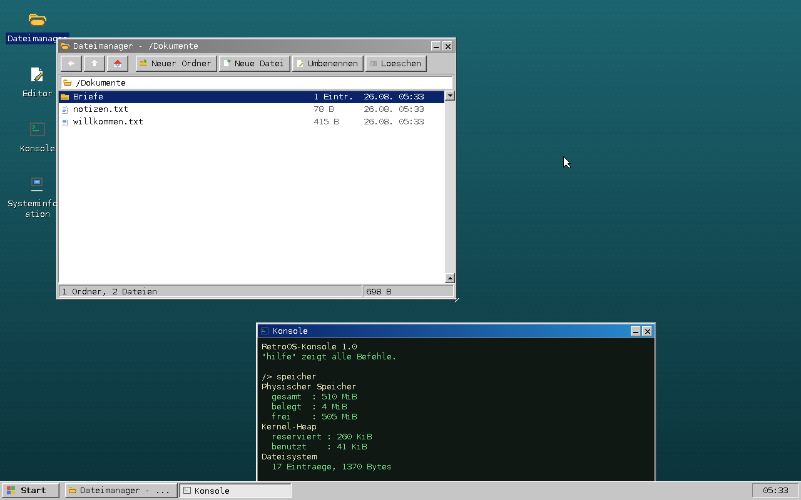
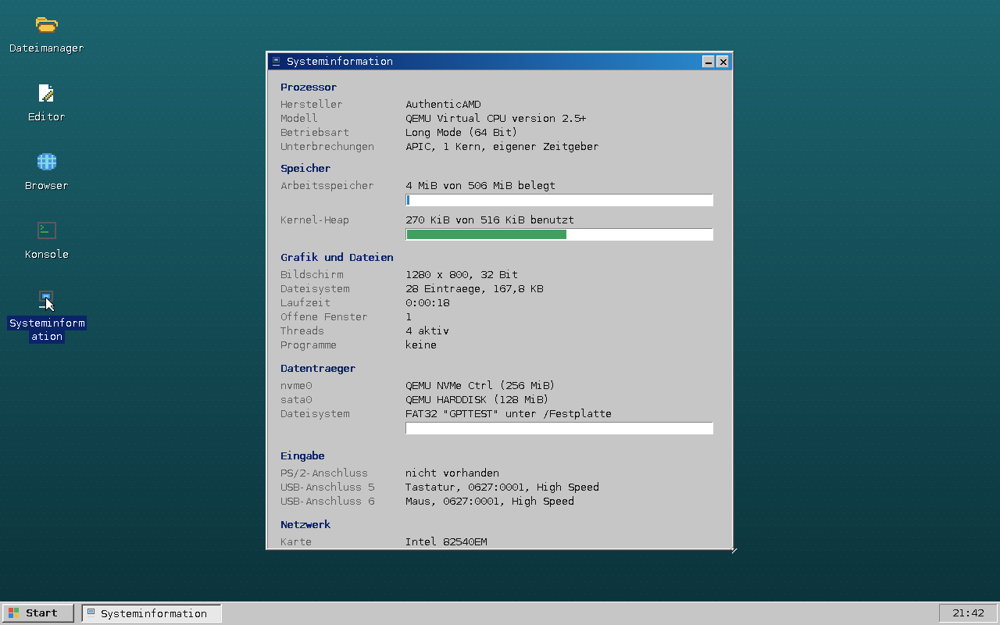

# RetroOS

Ein vollständig eigenes Betriebssystem für x86-64-Rechner – mit eigenem
64-Bit-Kernel, präemptivem Scheduler, Prozessen in Ring 3, eigenen
Treibern, eigenem Fenstersystem, einem dauerhaften Dateisystem auf der
Festplatte, einem TCP/IP-Stapel mit TLS 1.3 und einem Browser, der HTML,
CSS, Bilder und JavaScript versteht.

Unter der Haube ist RetroOS auf heutiger Hardware zu Hause: USB-Tastatur,
-Maus und -Sticks am xHCI-Controller, auch hinter einem Verteiler,
NVMe-SSDs und SATA-Platten, GPT-Partitionen, APIC und MSI statt des
Interruptcontrollers von 1976. Retro ist allein die Oberfläche – so soll
es auch sein.

Kein Linux-Unterbau, keine libc, kein fremdes GUI-Toolkit, keine
Netzwerk- oder Kryptobibliothek, keine Browser-Engine. Übernommen wurde
allein der Bootloader
([Limine](https://github.com/limine-bootloader/limine)), der den Kernel im
Long Mode startet und einen linearen Framebuffer bereitstellt.



```
┌──────────────────────────────────────────────────────────────────────┐
│  Desktop · Taskleiste · Startmenü                                    │
│  Dateimanager · Browser · Editor · Konsole · Info · Installieren     │
├──────────────────────────────────────────────────────────────────────┤
│  Fenstersystem (Fenster, Menüs, Dialoge, Bedienelemente)             │
├───────────────────────────────┬──────────────────────────────────────┤
│  Grafik: Backbuffer, Schrift  │  Browser: Dokumentbaum · CSS ·       │
│  Bilder: PNG JPEG GIF BMP     │  Umbruch · JavaScript                │
│  Inflate (DEFLATE)            ├──────────────────────────────────────┤
├───────────────────────────────┤  HTTP/1.1 · TLS 1.3                  │
│  Installation auf Festplatte  │  Kryptografie: SHA-2 · HMAC · HKDF · │
│  Dateibaum: RAM + FAT32       │  ChaCha20 · AES-GCM · X25519 · RSA · │
├───────────────────────────────┤  ECDSA · X.509 · 152 Wurzeln         │
│  Ring 3: Fenster · Sockets    ├──────────────────────────────────────┤
│  Scheduler auf mehreren Kernen│  TCP · UDP · DHCP · DNS · ICMP       │
├───────────────────────────────┤  IPv4 · ARP · Ethernet               │
│  Seitenverwaltung · Heap      │                                      │
├───────────────────────────────┼──────────────────────────────────────┤
│  Partitionen: GPT · MBR       │  Netzwerkkarten: virtio · Intel igb  │
│  Blockgeräte: NVMe · AHCI ·   │  e1000e · e1000 · Realtek 8169/8139  │
│  ATA · USB-Speicher           ├──────────────────────────────────────┤
│                               │  USB: xHCI · Verteiler · HID-Tastatur│
│                               │  und -Maus · Massenspeicher (SCSI)   │
├───────────────────────────────┴──────────────────────────────────────┤
│  PS/2 (falls vorhanden) · RTC · UART · PCIe · ACPI                   │
├──────────────────────────────────────────────────────────────────────┤
│  Unterbrechungen: lokaler APIC · IOAPIC · MSI/MSI-X · 8259A ersatz-  │
│  weise · Zeitgeber des APIC, sonst PIT                               │
├──────────────────────────────────────────────────────────────────────┤
│  Kern: GDT · IDT · TSS je Kern · Systemaufrufe · Spinlocks           │
└──────────────────────────────────────────────────────────────────────┘
```

## Bauen und starten

Vorausgesetzt werden `gcc`, `binutils`, `make`, `xorriso` und `git`
(zum Nachladen des Bootloaders). Zum Ausprobieren zusätzlich
`qemu-system-x86`.

```sh
sudo apt install build-essential xorriso qemu-system-x86 ovmf dosfstools
make                # baut den Kernel und retroos.iso
make run            # startet in QEMU – mit Festplatte und Netzwerk
make run-uefi       # dasselbe, aber per UEFI gebootet
make run-plain      # ohne Festplatte und ohne Netzwerk
```

`make run` legt beim ersten Aufruf `build/festplatte.img` an (256 MiB, FAT32)
und hängt eine Netzwerkkarte an. Die Platte bleibt bei `make clean` erhalten.

Das erzeugte `retroos.iso` ist ein Hybrid-Image: es bootet per BIOS *und*
per UEFI, aus einem virtuellen Laufwerk ebenso wie von einem USB-Stick.

```sh
sudo dd if=retroos.iso of=/dev/sdX bs=4M status=progress conv=fsync
```

> Auf echter Hardware kommt RetroOS mit USB-Tastatur und -Maus an einem
> xHCI-Controller zurecht – also mit dem, was ein heutiges Notebook
> mitbringt. Ist noch ein PS/2-Anschluss da, wird er ebenfalls benutzt;
> fehlt er, sagen das die ACPI-Tabellen und RetroOS klopft gar nicht erst
> an. Als Datenträger dienen NVMe-SSDs, SATA-Platten am AHCI-Controller
> oder ältere IDE-Laufwerke, jeweils mit GPT- oder MBR-Partitionstabelle.
> Beim Netzwerk sucht sich RetroOS aus, was auf dem PCI-Bus steckt:
> virtio-net in virtuellen Maschinen, Intel igb (I210, I350, 82576),
> Intel e1000e (82574L bis I219), die älteren 8254x sowie Realtek
> RTL8169/8168/8111 und RTL8139.

## Auf die Festplatte installieren

Vom Stick oder von der CD läuft RetroOS auch ohne Installation – die
Dateien liegen dann aber nur im Arbeitsspeicher. Wer das System behalten
will, startet **Installieren** auf dem Desktop (oder `installieren` in
der Konsole):

| Schritt | Was passiert |
| --- | --- |
| Ziel wählen | Alle Datenträger, die groß genug sind; der Startdatenträger selbst wird abgelehnt |
| Bestätigen | Zeigt die geplante Aufteilung – danach ist die Platte leer |
| Schreiben | GUID-Tabelle, zwei FAT32-Abschnitte, Bootloader, Kernel, Startsektor |

Angelegt wird der Aufbau, den ein heutiger Rechner erwartet:

```
Sektor 0        Schutzeintrag, damit alte Werkzeuge stillhalten
Sektor 1–33     die GUID-Tabelle
Sektor 34–…     zweiter Teil des Bootloaders (nur BIOS-Rechner lesen ihn)
Sektor 2048     EFI-Abschnitt, 64 MiB: BOOTX64.EFI, Kernel, limine.conf
danach          Ablage, der ganze Rest – hängt als /Festplatte im Baum
```

Ein UEFI-Rechner findet `\EFI\BOOT\BOOTX64.EFI` von selbst; ein
BIOS-Rechner liest den ersten Sektor. Beide Wege landen bei derselben
Kerneldatei. Danach kann das Startmedium weg: Der Rechner bootet von der
Platte, und was unter `/Festplatte` angelegt wird, liegt beim nächsten
Start wieder da.

Mindestgröße sind 72 MiB. Auf kleinen Platten fällt der EFI-Abschnitt
kleiner aus, denn FAT32 braucht mindestens 65525 Cluster.

## Bedienung

| Aktion | Wirkung |
| --- | --- |
| Doppelklick auf ein Desktop-Symbol | Programm starten |
| Start-Knopf unten links | Menü mit allen Programmen |
| Titelleiste ziehen | Fenster verschieben |
| Ecke unten rechts ziehen | Fenster vergrößern |
| `_` / `X` in der Titelleiste | Fenster ablegen / schließen |
| Klick in der Taskleiste | Fenster holen oder ablegen |

**Dateimanager:** Doppelklick öffnet Ordner und Dateien, die rechte Maustaste
öffnet das Kontextmenü. Über die Tastatur: Pfeiltasten wählen aus, `Eingabe`
öffnet, `Rücktaste` geht eine Ebene höher, `F2` benennt um, `Entf` löscht,
`F5` aktualisiert. Der Zweig `/Festplatte` liegt auf dem Datenträger, alles
andere im Arbeitsspeicher.

**Browser:** Adresse eintippen und `Eingabe`. Verweise, Knöpfe und
Eingabefelder sind bedienbar, `Rücktaste` geht zurück, `F5` lädt neu.

| Adresse | Bedeutung |
| --- | --- |
| `https://rechner/pfad` | verschlüsselte Seite aus dem Netz |
| `http://rechner/pfad` | unverschlüsselte Seite aus dem Netz |
| `datei:/Dokumente/beispiel.html` | Datei aus dem Dateisystem |
| `start:` | eingebaute Startseite |

Die Statuszeile nennt bei jeder Seite, ob und womit verschlüsselt wurde.
`datei:/Dokumente/pruefung.html` ist ein Selbsttest der Darstellung:
Schriftgrößen, Kästen, Tabellen, Bilder in drei Formaten und ein Skript
mit Knöpfen.

**Editor:** normales Tippen, `Strg`+`S` speichert – auch auf die Festplatte.

**Konsole:** `hilfe` zeigt alle Befehle. Neben `ls`, `cd`, `cat`, `mkdir`,
`touch`, `schreib`, `rm` und `edit` gibt es:

| Befehl | Wirkung |
| --- | --- |
| `starte <programm>` | ein Ring-3-Programm ausführen |
| `programme` | die eingebauten Programme auflisten |
| `threads` | laufende Threads mit Zustand und Rechenzeit |
| `platte` | Laufwerke und eingehängtes Dateisystem |
| `usb` | Geräte am USB-Bus mit Klasse und Geschwindigkeit |
| `formatieren wirklich [Name]` | Datenträger neu mit FAT32 formatieren |
| `netz` | IP-Adresse, Gateway, Namensserver, Paketzähler |
| `ping <ziel>` | Erreichbarkeit prüfen |
| `aufloesen <name>` | Namen in eine Adresse wandeln |
| `holen <adresse> [datei]` | Seite abrufen und wahlweise speichern |
| `starte server [port] [wurzel]` | Webserver – die Ablage vom Wirtsrechner aus durchsehen |
| `prozesse` | laufende Programme mit Verwandtschaft und geteiltem Speicher |
| `neustart` / `leeren` | Rechner neu starten, Bildschirm leeren |

Über das Startmenü lässt sich der Rechner auch abschalten – über ACPI,
also so, wie es ein Betriebssystem tut.



## Was drinsteckt

| Bereich | Umsetzung |
| --- | --- |
| **Start** | Limine-Protokoll, Higher-Half-Kernel bei `0xffffffff80000000` |
| **CPU** | eigene GDT mit TSS, IDT mit 48 Vektoren, Ausnahmebehandlung mit Panik-Ausgabe |
| **Interrupts** | lokaler APIC, IOAPIC samt Umlegungen aus der MADT, MSI und MSI-X für PCIe; 8259A als Rückfallebene |
| **Systemtakt** | Zeitgeber des lokalen APIC mit 1000 Hz, gegen den PIT ausgezählt; sonst der PIT selbst |
| **Scheduler** | präemptiv, Zeitscheiben von 20 ms, drei Prioritäten, Schlafen und Warten |
| **Prozesse** | ELF64-Lader, eigener Adressraum je Prozess, Ring 3, Systemaufrufe über `SYSCALL`/`SYSRET`; Abspalten mit Kopie beim Schreiben, Warten auf Kinder, Prozessgruppen an einer Konsole |
| **Speicher** | Bitmap-Allokator für Seitenrahmen, Besitzerzähler je Seite, vierstufige Seitentabellen, Heap mit Blockverschmelzung |
| **Busse** | PCI und PCIe über Konfigurationsmechanismus 1, 64-Bit-Adressbereiche, Fähigkeitenliste |
| **Datenträger** | NVMe über PCIe mit eigenen Warteschlangen, AHCI (SATA, DMA), ATA-PIO, USB-Speicher über SCSI |
| **Partitionen** | GPT samt Sicherungstabelle, MBR mit erweiterten Abschnitten, roher Datenträger |
| **Installation** | Schreibt eine eigene GUID-Tabelle, formatiert EFI-Abschnitt und Ablage, kopiert Bootloader und Kernel und setzt den Startsektor für BIOS-Rechner |
| **Dateisystem** | FAT32 mit langen Dateinamen – lesen, schreiben, anlegen, umbenennen, löschen, formatieren |
| **USB** | xHCI-Controller: Befehls-, Ereignis- und Übertragungsringe, Geräteaufzählung über mehrere Verteiler hinweg, Unterbrechungs- und Massenendpunkte |
| **Eingabe** | USB-Tastatur und -Maus im Boot-Protokoll, dazu der 8042-Controller, wo es ihn noch gibt; deutsche Belegung inkl. AltGr |
| **Grafik** | 32-Bit-Framebuffer, Backbuffer, Clipping, Verläufe, 3D-Kanten, frei skalierbare Bitmapschrift |
| **Bilder** | eigener DEFLATE-Entpacker, PNG (alle Farbtypen, Adam7), JPEG (Grundverfahren), GIF, BMP |
| **Netzwerkkarten** | virtio-net (alte und neue Bauform), Intel igb, e1000e und 8254x, Realtek RTL8169/8168/8111 und RTL8139 – hinter einer gemeinsamen Schnittstelle, der erste passende Treiber bekommt die Karte |
| **Netzwerk** | Ethernet, ARP, IPv4, ICMP, UDP, DHCP, DNS, TCP, HTTP/1.1 |
| **TCP** | Fenstersteuerung, Umsortierung, langsamer Start, Überlastvermeidung, schnelle Wiederholung; als Client *und* als Server mit Warteschlange, geschlossene Ports antworten mit RST |
| **Kryptografie** | SHA-256/384/512, HMAC, HKDF, ChaCha20-Poly1305, AES-128/256-GCM, X25519, RSA, ECDSA P-256 |
| **TLS** | TLS 1.3 als Client, X.509-Ketten gegen 152 eingebaute Wurzelzertifikate |
| **Browser** | Dokumentbaum, CSS-Kaskade, Kastenmodell, Bilder, JavaScript |
| **Energie** | ACPI: RSDP, XSDT, FADT, DSDT mit `_S5_`-Auswertung zum Abschalten |
| **Oberfläche** | Fensterstapel, Fokus, Verschieben, Größe ändern, Taskleiste, Popup-Menüs, Dialoge |
| **Kerne** | Alle Kerne des Rechners werden gestartet; eigene GDT, TSS und Zeitgeber je Kern, gemeinsame Daten unter Warteschlangensperren |
| **Ring 3** | Eigene Fenster und TCP-Verbindungen über Systemaufrufe – ein Benutzerprogramm kann zeichnen, ins Netz und selbst zuhören |
| **Webserver** | `starte server` liefert die Ablage über HTTP aus; ein Ring-3-Programm, das lauscht, annimmt und je Verbindung ein Kind abspaltet |
| **Einstellungen** | Tastaturbelegung (de/us/ch), Zeitzone, Rechnername und Hintergrund in `/Festplatte/retroos.conf` |
| **Zwischenablage** | Kopieren und Einfügen zwischen Editor, Konsole und Browser |
| **Programme** | Dateimanager, Browser, Texteditor, Konsole, Systeminformation, Installation, Einstellungen, elf Ring-3-Programme |

### Der Browser im Einzelnen

Der Ablauf entspricht dem eines richtigen Browsers:

1. Die Seite wird geholt – über HTTP oder über TLS 1.3 – und zu einem
   **Dokumentbaum** zerlegt. Fehlende Schlusszeichen, verschachtelte
   Absätze und rohe Bereiche wie `<script>` behandelt der Leser so, wie
   es die Praxis verlangt.
2. Eingebundene **Formatvorlagen, Skripte und Bilder** werden nachgeladen –
   jedes als eigener Auftrag an einen Arbeits-Thread, damit die Oberfläche
   bedienbar bleibt.
3. Die **Kaskade** gewichtet Element-, Klassen- und Kennungsselektoren,
   Nachfahrenbeziehungen, das `style`-Attribut und `!important`. Eigene
   Eigenschaften (`--name` und `var()`) werden vererbt, `calc()`, `min()`,
   `max()` und `clamp()` ausgerechnet.
4. Die **Skripte** laufen und dürfen den Baum verändern.
5. Der Baum wird nach dem **Kastenmodell** umgebrochen: Blöcke
   untereinander, Inline-Inhalt in Zeilen, mit Außen- und Innenabständen,
   Rahmen, Ausrichtung, schwebenden Kästen und Tabellen.

Ändert ein Skript später etwas – durch einen Klick, eine Eingabe oder
einen Zeitgeber – werden die Schritte drei bis fünf wiederholt.

Der JavaScript-Deuter versteht den üblichen Sprachumfang: Variablen mit
`var`, `let` und `const`, Funktionen, Abschlüsse, Pfeilfunktionen,
Vorgabewerte und Restparameter, Objekte, Felder, Zerlegung, Klassen mit
Vererbung, Vorlagen mit `${…}`, Ausnahmen sowie die eingebauten Objekte
`Object`, `Array`, `String`, `Number`, `Math`, `JSON`, `Date` und
`console`. Vom Dokument aus erreichbar sind unter anderem
`getElementById`, `querySelector`, `createElement`, `appendChild`,
`innerHTML`, `textContent`, `classList`, `style`, `addEventListener`,
`setTimeout` und `setInterval`.

Zahlen sind Festkommazahlen mit 16 Nachkommastellen statt Gleitkommazahlen:
Der Kern wird ohne Gleitkommaeinheit übersetzt, damit ein Kontextwechsel
keine Registersätze retten muss. Der Bereich reicht von etwa plus/minus
140 Billionen bei einer Genauigkeit von 1/65536 – für Seitenskripte,
Zeitangaben und Koordinaten mehr als genug.

### Alt und neu nebeneinander

RetroOS sucht sich zur Laufzeit aus, welchen Weg es nimmt – ohne dass
dafür zwei Fassungen gebaut werden müssten:

| Aufgabe | bevorzugt | Rückfallebene |
| --- | --- | --- |
| Unterbrechungen | lokaler APIC und IOAPIC | 8259A-PIC |
| Unterbrechung eines PCIe-Geräts | MSI oder MSI-X | Leitung im IOAPIC bzw. PIC |
| Systemtakt | Zeitgeber des lokalen APIC | PIT |
| Eingabe | USB-HID am xHCI | PS/2 am 8042 |
| Datenträger | NVMe | AHCI, dann ATA-PIO, dann USB-Speicher |
| Aufteilung | GPT | MBR, sonst roher Datenträger |

Ob es einen PS/2-Anschluss gibt, verrät die FADT in ihren
Boot-Kennzeichen; wo die Angabe fehlt, klopft RetroOS vorsichtig an und
wartet mit begrenzter Geduld. Das ist kein Schönheitsfehler, sondern
notwendig: An einem Rechner ohne 8042 liest man am Statusport lauter
Einsen, und ein Treiber, der darauf wartet, dass sie verschwinden,
wartet für immer.

Der Zeitgeber des lokalen APIC läuft mit einem Takt, der nirgends
verzeichnet ist. Er wird deshalb beim Start einmal gegen Kanal 2 des PIT
ausgezählt – die einzige Stelle, an der der alte Baustein noch gebraucht
wird, und selbst die nur zum Nachmessen.

Am USB-Bus hängt selten alles unmittelbar an der Wurzel: In einem
Notebook sitzt zwischen Chipsatz und Tastatur meist noch ein Verteiler.
Damit der Controller ein Gerät dahinter überhaupt ansprechen kann,
braucht er eine Wegbeschreibung – vier Bit je Ebene, bis zu fünf Ebenen
tief. RetroOS zählt deshalb rekursiv auf: Wird ein Verteiler gefunden,
werden dessen Anschlüsse auf demselben Weg abgesucht.

### Wie die Teile zusammenspielen

Der Dateibaum kennt zwei Sorten von Knoten. Alles unterhalb von
`/Festplatte` spiegelt Einträge eines FAT32-Datenträgers: Ordner werden
gelesen, sobald jemand hinsieht, und jede Änderung geht sofort auf die
Platte. Der Rest liegt im Arbeitsspeicher und ist nach einem Neustart wieder
im Auslieferungszustand. Nach außen sieht man den Unterschied nicht – der
Dateimanager, der Editor und die Konsole benutzen dieselben Funktionen.

Die Datenträger sind mit anderen Systemen austauschbar: was RetroOS
schreibt, liest Linux oder Windows ohne Weiteres, samt langer Dateinamen.

Die Oberfläche bleibt während des Ladens bedienbar, weil der Browser
seine Aufträge an einen eigenen Thread abgibt. Damit das ohne Verklemmung
geht, gilt im Kern eine einfache Regel: Wer die Umschaltung sperrt, darf
nicht blockieren. Ein Verstoß dagegen endet in einer Panik statt in einem
stehenden Bild – so wurde der Fehler gefunden, der ARP-Auflösung unter
gesperrter Umschaltung betrieb.

Anwendungen laufen wahlweise als Teil des Kernels – die Fensterprogramme –
oder als eigener Prozess in Ring 3 mit eigenem Adressraum. Ein Programm,
das dort abstürzt, reißt nichts mit: `starte absturz` zeigt es vor.

## Tests

Die Bausteine, die sich ohne Bildschirm prüfen lassen, haben eine
Testsammlung, die auf dem Entwicklungsrechner läuft:

```sh
cd tests && make
```

| Sammlung | Was geprüft wird |
| --- | --- |
| **Kryptografie** | 68 Prüfungen gegen FIPS 180-4, RFC 4231, RFC 5869, RFC 8439, FIPS 197, NIST GCM, RFC 7748, RFC 8448 und echte OpenSSL-Signaturen |
| **Bilder** | 13 Prüfungen: PNG in allen Farbtypen und Bittiefen samt Adam7, GIF verschränkt, BMP, JPEG gegen libjpeg |
| **JavaScript** | 55 kleine Programme mit erwarteter Ausgabe |
| **Dokumentbaum** | 83 Prüfungen zu Zerteiler, Kaskade, Umbruch, Skripten am Baum und Zeitgebern |

Die Testbilder erzeugt `make testbilder` neu (benötigt Pillow).

## Aufbau des Quelltexts

```
kernel/
  include/            Öffentliche Header aller Bausteine
  linker.ld           Speicheraufteilung des Kernels
  src/
    main.c            Startreihenfolge des Systems
    arch/             GDT, IDT, Interrupt-Stubs, APIC, IOAPIC, PIC, Zeitgeber,
                      ACPI, Systemaufrufe, Kerne und ihr Start
    mm/               Seitenverwaltung, Adressräume und Heap
    sched/            Threads und präemptiver Scheduler auf allen Kernen
    proc/             ELF64-Lader, Prozesse in Ring 3, Fenster für Programme
    drivers/          Framebuffer, PS/2, Tastatur, Maus, RTC, UART, PCI,
                      NVMe, AHCI, ATA, Blockgeräte, xHCI, USB-HID,
                      USB-Speicher, virtio-net, igb, e1000e, e1000,
                      RTL8169, RTL8139
    fs/               Dateibaum, FAT32, Partitionstabellen, Startbestand,
                      Installation auf Festplatte
    net/              Kartenauswahl, Ethernet, ARP, IPv4, ICMP, UDP, DHCP, DNS,
                      TCP, TLS, HTTP
    crypto/           SHA-2, HKDF, ChaCha20, AES, X25519, Großzahlen,
                      RSA, P-256, ASN.1, X.509, Wurzelzertifikate
    gfx/              DEFLATE, PNG, JPEG, GIF, BMP, Skalieren und Zeichnen
    lib/              Zeichenketten, Ausgabe, 128-Bit-Division
    gui/              Grafik, Schrift, Symbole, Fenstersystem, Desktop, Bedienelemente
    js/               Zerteiler, Deuter, Bibliothek und Anbindung an den Baum
    apps/             Dateimanager, Browser, Installation, Einstellungen,
                      Dokumentbaum, HTML-Leser,
                      CSS, Umbruch, Editor, Konsole, Systeminformation, Dialoge
userland/             Ring-3-Programme samt kleiner Laufzeitbibliothek
data/                 Wurzelzertifikate und Beispielbilder
tests/                Testsammlungen für den Entwicklungsrechner
boot/limine.conf      Bootloader-Eintrag
scripts/              Bootloader holen, Schrift, Zertifikate und Bilder erzeugen
```

Erzeugte und eingecheckte Dateien: die Schrift in
`kernel/src/gui/font_data.c` (`python3 scripts/gen_font.py`), die
Wurzelzertifikate in `data/wurzelzertifikate.der`
(`python3 scripts/gen_trust_store.py`) und die Beispielbilder in `data/`
(`python3 scripts/gen_bilder.py`).

## Bekannte Grenzen

**Viele kurzlebige Prozesse auf mehreren Kernen.** Wer rasch hintereinander
Programme startet und beendet – `starte gabeln 8` etwa, oder der Webserver
unter Last –, bringt RetroOS auf zwei und mehr Kernen nach einigen Sekunden
zum Stehen: ein Kernel-Stapel wird beschrieben, während sein Thread noch
darauf steht. Der Fehler steckt im Abbau von Threads und ist älter als das
Abspalten; er lässt sich auch ohne `fork` auslösen, indem man auf vier Kernen
sechsmal `starte hallo` hintereinander eingibt. Mit einem Kern
(`-smp 1`, die Voreinstellung) tritt er nicht auf. Bis das behoben ist,
gehören mehrere Kerne und starker Prozesswechsel nicht zusammen.

## Fehlersuche

Der Kernel schreibt seine Meldungen auf die serielle Schnittstelle, nicht auf
den Bildschirm – dort läuft die Oberfläche. In QEMU erscheinen sie dank
`-serial stdio` direkt im Terminal:

```
=====================================
  RetroOS 1.0 - Systemstart
=====================================
Bildschirm  : 1280x800, 32 Bit
PMM         : 506 MiB verwaltet, 506 MiB frei
Heap        : 260 KiB bereit
Adressraum  : Kernel-Tabelle bei 0x000000001fea1000, Ausfuehrsperre aktiv
ACPI        : PM1a 0x604, S5 = 0/0
APIC        : 1 Kern, 1 IOAPIC mit 24 Eingaengen
APIC-Timer  : 1000 Hz, 62636 Takte je Millisekunde
PS/2        : laut ACPI nicht vorhanden
PCI         : 8 Geraete gefunden
  00:02.0  1b36:0010  NVMe-Controller
  00:03.0  1b36:000d  USB-Controller
  00:04.0  1af4:1000  Netzwerkkarte
Datentraeger: nvme0 - QEMU NVMe Ctrl, 256 MiB
USB         : xHCI mit 8 Anschluessen, 8 Steckplaetzen, MSI
USB         : Anschluss 5, 0627:0001, Klasse 3.1.1, High Speed
USB         : Tastatur angemeldet
USB         : Anschluss 6, 0627:0001, Klasse 3.1.2, High Speed
USB         : Maus angemeldet
Dateisystem : 28 Eintraege, 202974 Bytes
Datentraeger: GPT, Abschnitt 2 ab Sektor 34816
Datentraeger: RETROOS eingehaengt unter /Festplatte (235 MiB frei)
Scheduler   : bereit, Zeitscheibe 20 ms
Systemaufrufe: bereit (14 Nummern)
Zertifikate : 152 Wurzeln geladen
Netzwerk    : virtio-net (1.0), 52:54:00:12:34:56
Netzwerk    : 10.0.2.15, Gateway 10.0.2.2, DNS 10.0.2.3
Oberflaeche : bereit
```

Eine CPU-Ausnahme hält das System an und gibt Vektor, Fehlercode, `RIP`,
`RSP` und `CR2` aus. Was ein Skript auf `console.log` schreibt, landet
ebenfalls auf der seriellen Schnittstelle.

Zum Ausprobieren des Browsers genügt ein beliebiger Webserver auf dem
Wirtsrechner; unter QEMUs Benutzer-Netzwerk ist er aus RetroOS heraus als
`10.0.2.2` erreichbar:

```sh
cd /pfad/zu/seiten && python3 -m http.server 8000
# in RetroOS:  http://10.0.2.2:8000
```

Wer die modernen Wege ausprobieren will, gibt QEMU die passenden Geräte
mit – ganz ohne PS/2, mit USB-Eingabe und einer NVMe-SSD:

```sh
qemu-system-x86_64 -M q35,i8042=off -m 512M -cdrom retroos.iso -boot d \
  -device qemu-xhci,id=xhci \
  -device usb-hub,bus=xhci.0,port=2 \
  -device usb-kbd,bus=xhci.0,port=2.1 \
  -device usb-mouse,bus=xhci.0,port=2.2 \
  -drive file=stick.img,if=none,id=stick,format=raw \
  -device usb-storage,bus=xhci.0,port=3,drive=stick \
  -drive file=platte.img,if=none,id=nvm0,format=raw \
  -device nvme,serial=RETRO0001,drive=nvm0 \
  -netdev user,id=n0 -device virtio-net-pci,netdev=n0 -serial stdio
```

## Lizenz

MIT – siehe [LICENSE](LICENSE). Der beim Bauen geladene Bootloader Limine
steht unter der BSD-2-Clause-Lizenz.
